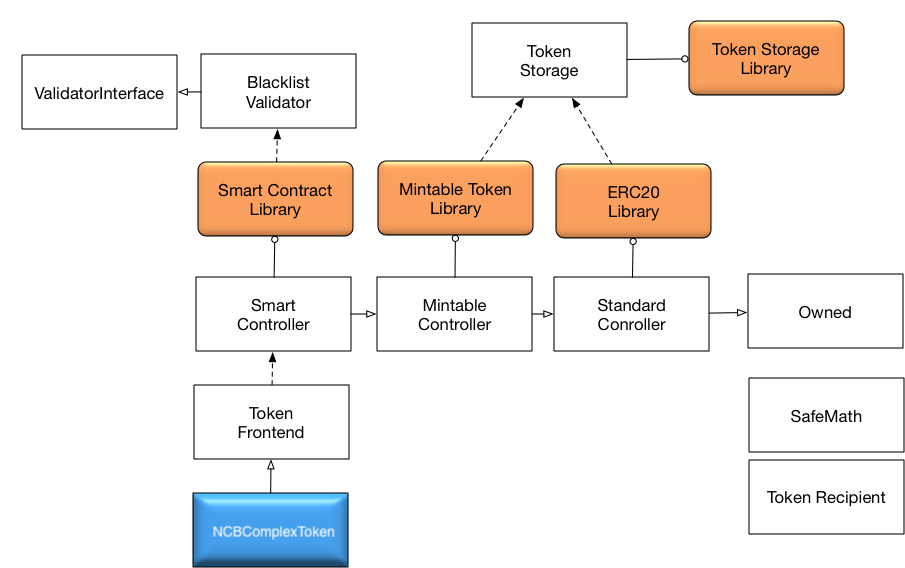
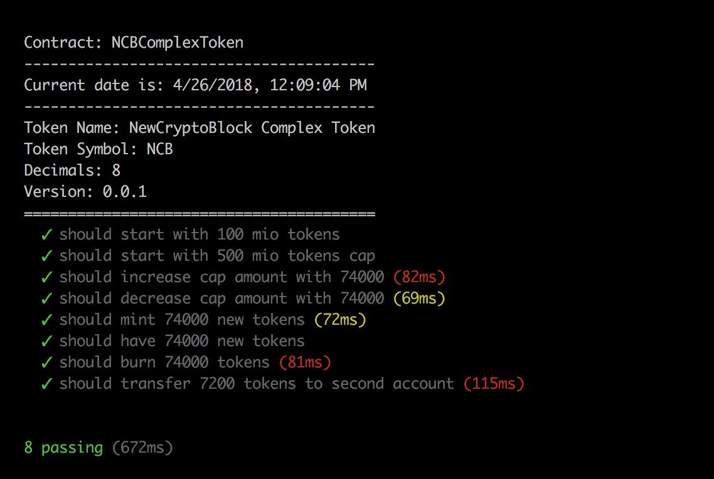

# NewCryptoBlock NCB Complex Token

This is implementation of ERC20 NCB complex token.

Implementation supports also following protections:
- Pause and Unpause transfers
- Burn and Mint
- Short address protection
- Blacklist validation
- Cap token limit with increase/decrease functionality

Design is modular and upgradable. 

*Contracts are represented by white boxes and libraries by orange boxes with rounded corners*

## Implementation

The NCB complex token system is build upon community vetted libraries where possible to minimise the risk of bugs. This implementaion is based on monerium/smart-contracts implementation.

Additional functionality has been implemented in `MintableTokenLib.sol` and `SmartTokenLib.sol`. This includes minting and burning tokens and defining validators who determine whether token transactions are valid or not.

Functionality which requires authorization is protected implementation of the Owned contract. 

### Solidity libraries

Libraries in Solidity provide the means to deploy an implementation once as a compiled bytecode but without an execution context (storage). Contracts deployed subsequently can then be statically linked to the library.

OBL complex token system takes advantage of this feature to save gas deploying multiple tokens. It can also be argued that sharing audited libraries between contracts can reduce the risk of bugs &mdash; and worst case ease the replacement of a buggy implementation.
  
### Token Systems

NCB complex token is designed, based on monerium/smart-contracts implementation token system and implemented using Solidity libraries. A token system is a methodology which aims to separate the token into three modules, providing the means for composable and upgradable tokens, based on MVC industry standard.

#### 1. *Frontend*

    This contract implements the token standard and provides a permanent Ethereum address for the token system. 
    All method calls on this contract are forwarded to the controller.

#### 2. *Controller*

    The controller is responsible for the business logic, which is implemented as a library. Our controllers are 
    further separated by the functionality they provide into; standard controller, mintable controller and 
    smart controller.

#### 3. *Storage*

    Permanent token storage for controllers. Should the storage layout change in the future a new token storage with the 
    extra data fields referencing the old token storage.

Using this design token is upgradeable, business logic maintainable and extendable; while providing a fixed address on the blockchain and permanent access to the token bookkeeping.

## Test Results

Following is test results that we have

#### Copyright &copy; 2018  NewCryptoBlock.
